# 동적으로 스케줄링 적용하기 (TaskScheduler)

### 📌 상황
현재 진행하고 있는 "원만한 친구 사이를 위한 약속 지킴이 서비스" 오디(ody) 프로젝트는 친구들이 약속에 지각하지 않도록 돕기 위해  
친구들의 출발 위치와 만나기로 약속한 장소까지 걸리는 소요 시간을 외부 API를 이용하여 계산해 출발 시간 알림을 보내준다.  
때문에 사용자별로 다른 시간에 출발 알림이 가도록 동적 스케줄링이 필요했고 이러한 기능을 적용할 수 있는 방법에 대해 알아보았다.  

  

### 📌 정적 스케줄링과 동적 스케줄링

그렇다면 동적 스케줄링이란 뭘까 ?
정적과 동적에 대한 차이부터 알 필요가 있다.
정적이란 말 그대로 정적인, 고정적인 것이고
애플리케이션 시작 시 설정한 값이 종료까지 고정된다.

동적이란 말 그대로 계속 변화하는
즉, 애플리케이션 런타임 시점에 원하는 데로 바뀌는 것이다.

정적 스케줄링과 동적 스케줄링은 위 개념대로 스케줄링, 작업을 “예약"하는 것이다.

  

### 📌 @Scheduled를 사용한 정적 스케줄링

사용자별로 다른 시간에 출발 알림을 전송하는 기능을 구현하기 위해 스케줄링을 적용하려 했다.
하지만 처음에는 @Scheduled로 적용하는 스케줄링이 밖에 알지 못했고
다른 스케줄링 기술이 있는지는 알지 못해 @Scheduled를 사용한 스케줄링은 정적 스케줄링으로
기능을 구현할 생각을 하고 있었다.

아래 코드는 @Scheduled의 간단한 예시로 cron 표현식을 사용해
1초마다 필자의 블로그 링크가 출력되는 코드이다.

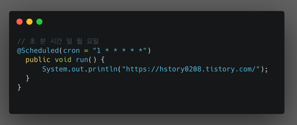

필자가 원하는 사용자별로 다른 출발 알림을 보내기 위해서는
사용자마다 각자 다른 시간에 알림을 보낼 수 있도록 작업 예약을 “한 번”만 하면 된다.
하지만 @Scheduled를 사용한 정적 스케줄링은 cron 표현식으로 작성하게 되면 문자열로 작성하게 되어
알림 요청이 없는 상황에서도 설정한 시간마다 스케줄링이 동작하기 때문에
서버 리소스 낭비가 너무 심하다는 단점이 있었다.

그렇게 필자가 원하는 니즈에 맞는 기술을 찾기 위해 열심히 검색하다,
우아한 테크 코스 5기 선배님들의 "페스타고"에서 사용한 동적 스케줄링 포스팅을 볼 수 있었고
필자가 원하는 바와 일치하는 TaskScheduler를 사용해 사용자별로 알림을 보내기로 하였다.

  

### 📌 TaskScheduler란 ?

TaskScheduler는 스프링에서 제공하는 스케줄링 인터페이스로
복잡한 스케줄링 요구사항이 있거나 런타임에 스케줄을 조정해야 하는 경우에
코드를 통해 동적으로 스케줄링할 수 있다.   
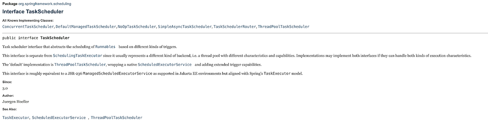

  

@Scheduler는 기본적으로 단일 스레드에서 동작하는 반면
TaskScheduler는 멀티스레드 환경에서 동작한다.
그래서 높은 동시성을 가져 여러 작업을 병렬로 처리할 경우 처리량이 증가할 수 있고,
복잡하고 시간이 오래 걸리는 작업에 더 적합할 수 있다.
기본적으로 TaskScheduler 스레드풀 크기는 1로 고정되어 있는데, 아래와 같이 설정도 가능하다.  
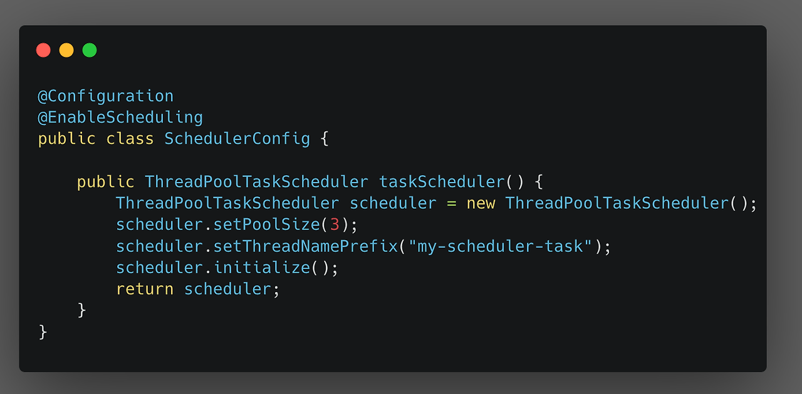

  

### 📌 TaskScheduler를 사용한 동적 스케줄링 적용해보기

우선 스케줄링을 사용하기 위해선 아래와 같이 Scheduling을 빈 등록해 주어야 한다.
스레드 풀에 대한 설정도 필요하다면 이전 이미지와 같이
ThreadPollTaskScheduler를 설정해 주면 된다.  
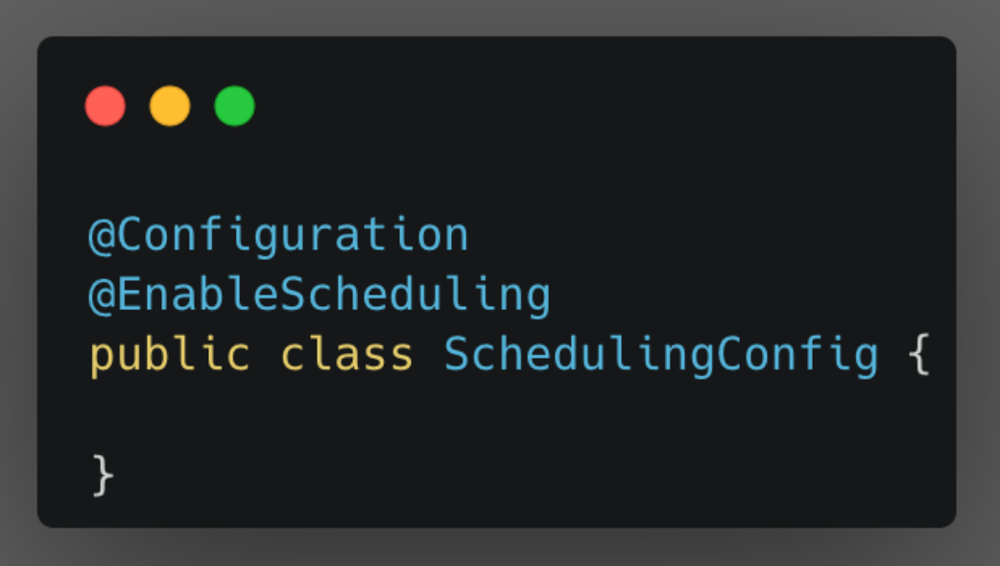

  

그다음으로는 TashScheduler를 사용해 동적 스케줄링 코드를 작성하는 법에 대해 보자.  
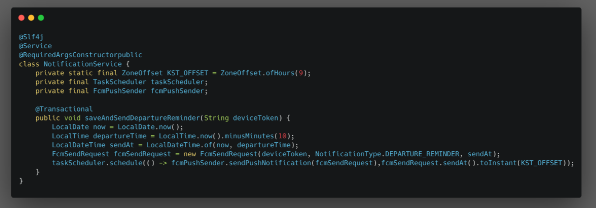

  

위 코드에 있는 FcmPushSender는 FCM으로 메시지를 전달하는 객체로
이 관련 코드는 크게 관련 없으므로 생략한다.

해당 서비스에서 동적 스케줄링을 사용하기 위해 TaskScheduler를 의존성 주입해 주자.
그리고 이 TaskScheduler의 schedule() 메서드를 사용해 원하는 작업을 예약할 수 있다.  
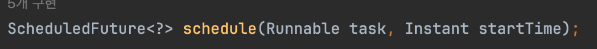

  

1번째 인자는 실행할 작아, 2번째 인자에는 이벤트를 처리할 시간을 추가해 준다.

2번째 인자는 Instant 타입이기 때문에 LocalDateTime 타입인 sendAt을
한국 시각을 가진 Instant 객체로 변환하였다.

이제 NotificationService의 saveAndSendDepartureReminder() 메서드가 호출되면
현재 날짜 시간에서 10분 전에 알림을 보내도록 TaskScheduler에 스케줄링하고
TaskScheduler는 10분 뒤에 Runnable의 인자로 들어간 작업을 처리하게 된다.

설명을 위해 고정적인 10분으로 예약되게 했지만,
요청 데이터를 통해 사용자별로 다른 시간에 작업이 예약되도록 할 수 있다.
TaskScheduler 실행 흐름

TaskScheduler의 실행 흐름을 이해하기 쉽도록 그림으로 표현해 보았다.  

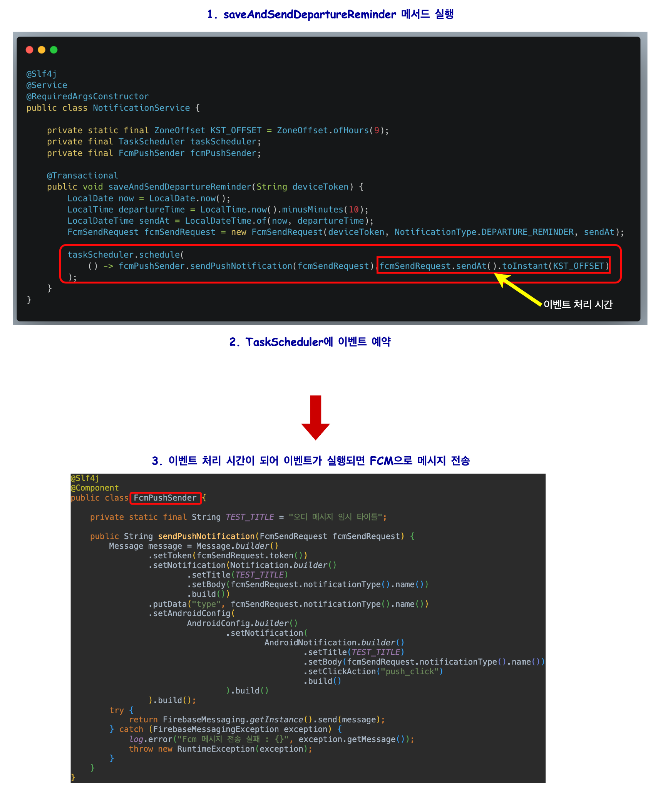

  

### 📌 TaskScheduler로 예약된 이벤트 테스트하기

그렇다면 정말 의도한 시간에 작업이 예약되고 원하는 작업이 실행했는지
테스트를 통해 알고 싶지 않은가?

그런데 시간을 지정했기 때문에 정말 그 시간에 작업이 예약됐는지를 확인하려 하면
1시간 후에 작업이 예약되고 이때 원하는 작업이 잘 실행됐는지 테스트하기 위해서
테스트 코드를 실행하는 데 1시간을 기다릴 순 없는 노릇이다..

런타임 시점에 동적으로 스케줄링 되는 것을 어떻게 테스트할 수 있을까?

  

> ArgumentCaptor를 사용한 테스트
 
ArgumentCaptor는 Mockito 프레임워크에서 클래스로
Mock 객체의 메소드가 호출될 때 전달되는 인자를 이름 그대로 "캡처"하고 검증하는 데 사용된다.

필자는 원하는 시간에, 원하는 작업이 잘 실행되는지에 대한 부분을 검증하고 싶었기 때문에 ArgumentCaptor를 사용해 테스트할 수 있었다.

어떤 식으로 테스트할 수 있었는지 한번 확인 해보자.

일단 코드를 간단하게 코드를 설명하면 meetingService.saveV1()가 호출되면 내부에서 taskScheduler.schedule()가 실행되고,
이 때 meeting 객체에 있는 약속 시간 30분 전에 taskScheduler에 fcmPushSender.sendNoticeMessage() 로직을 예약한다.  
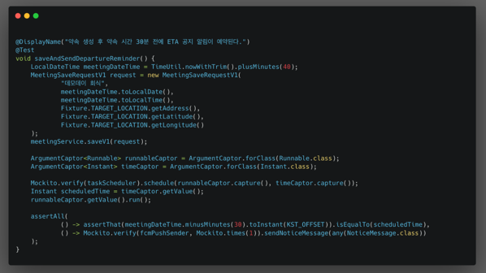

  

taskScheduler 내부 작업이 의도한 대로 잘 동작하는지 확인하기 위해 작성한 코드를
ArgumentCaptor 코드 라인부터 한 줄씩 확인해 보자.

1. taskScheduler의 schedule()메서드에 사용되는 인자 타입들을 캡처할 ArgumentCaptor 객체 생성한다.  
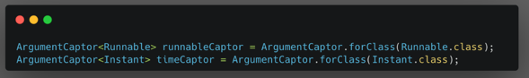

  

2. meetingService.saveV1()가 호출 후에 실행됐어야 할 해당 로직이 실행됐는지 검증함과 동시에 이 호출에 전달된 인자를 캡처한다.  
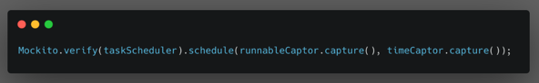

  

3. 캡처해 놓은 값을 반환 후 의도한 데로 동작하는지 검증한다.  
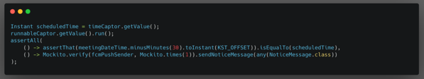

  

약속을 현재 시간으로 부터 40분 후로 생성했고 ETA 공지 목록 확인 알림을 스케줄링하는 작업 로직에선 이 약속 시간 30분 전으로 작업을 예약한다.
따라서 timeCaptor.getValue()로 얻은 scheduledTime이 지금으로부터 10분 뒤인지를 검증하였고
runnableCaptor.getValue()로 부터 얻은 Runnable을 run()으로 실행해  fcmPushSender.sendNoticeMessage()이 실행됐는지 검증할 수 있었다.

